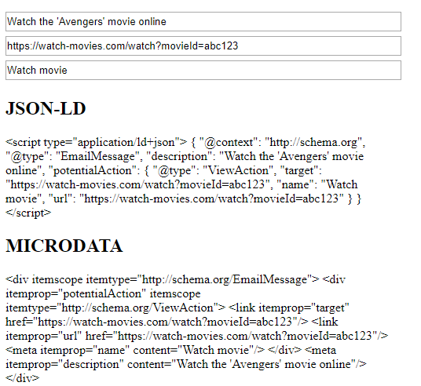

# Email Markup (View Action) Generator

#### It generates json-ld & microdata for email list on gmail 

Email Markup => Go-To Actions => [ViewAction](https://developers.google.com/gmail/markup/reference/go-to-action#view_action)

https://developers.google.com/gmail/markup/reference/go-to-action#view_action


Example from [ViewAction](https://developers.google.com/gmail/markup/reference/go-to-action#view_action) web site
```html
<script type="application/ld+json">
{
  "@context": "http://schema.org",
  "@type": "EmailMessage",
  "potentialAction": {
    "@type": "ViewAction",
    "target": "https://watch-movies.com/watch?movieId=abc123",
    "name": "Watch movie"
  },
  "description": "Watch the 'Avengers' movie online"
}
</script>
```

### Output 




### Guidelines

To fully implement this, you need to [Register with Google](https://developers.google.com/gmail/markup/registering-with-google)

And follow this steps:

*Send a real-life email coming from your production servers (or a server with similar DKIM/SPF/From:/Return-Path: headers) including the markup / schema to schema.whitelisting+sample@gmail.com. We need this in order to check that you comply with all the guidelines and requirements listed in Registration Guidelines.
  *If you send a test/blank email, an email that does not contain schema or if you don't send an email for review your application will be silently discarded.
  *Make sure that the markup is correct prior to sending the email. For more details see Testing your Schema. Especially make sure the email passes the Email markup Tester and that there are no errors, also make sure to include as much data as possible.
  *Gmail removes all markup when forwarding an email. Do not forward the email but send it directly.
*Fill out the registration form and we will get back to you.